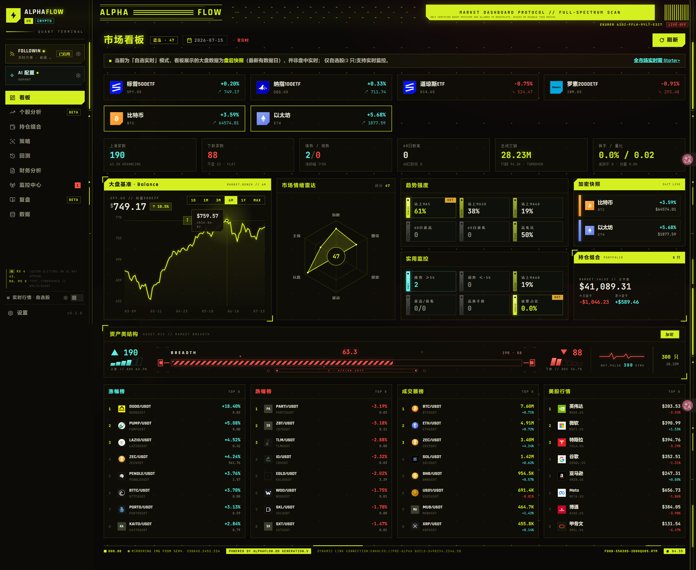
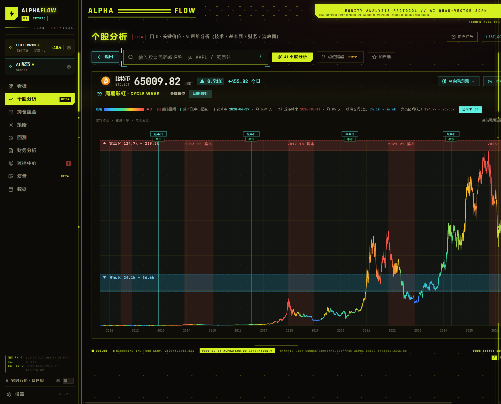
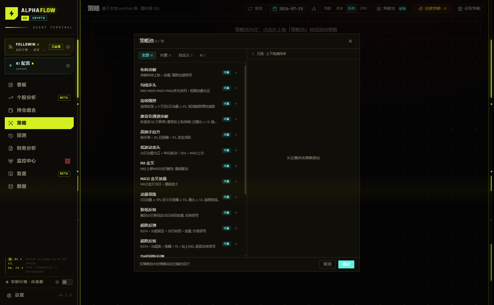
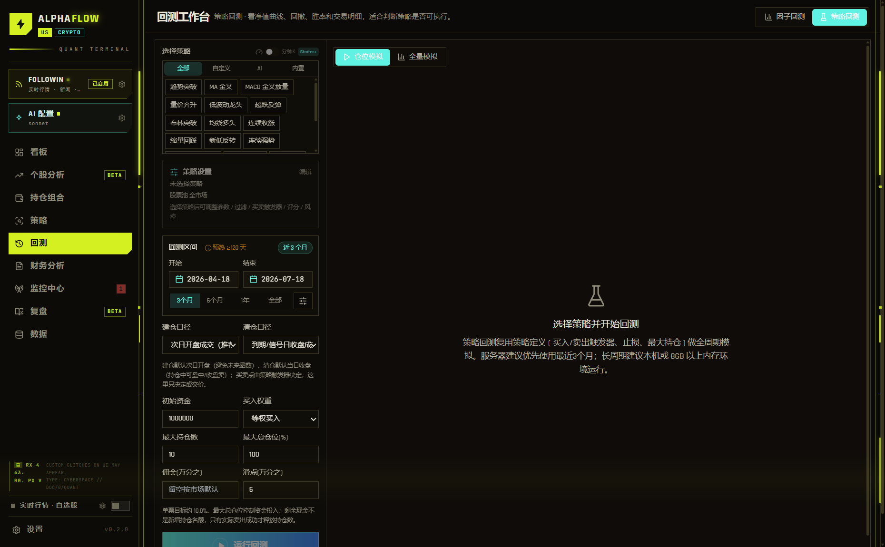
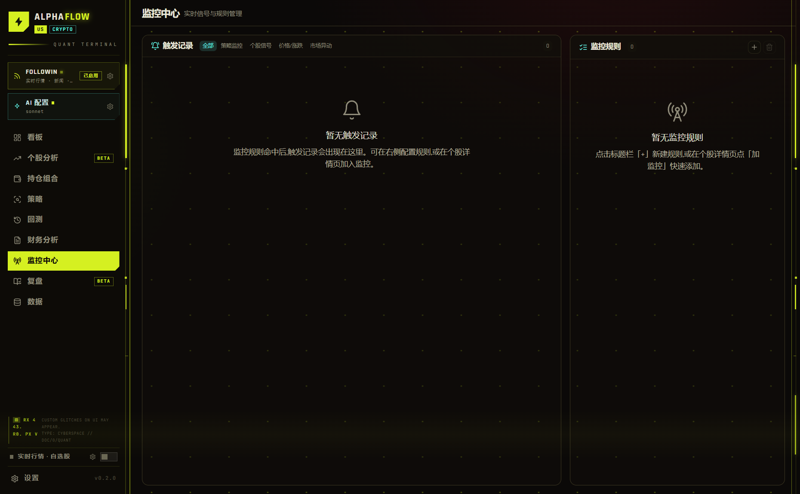
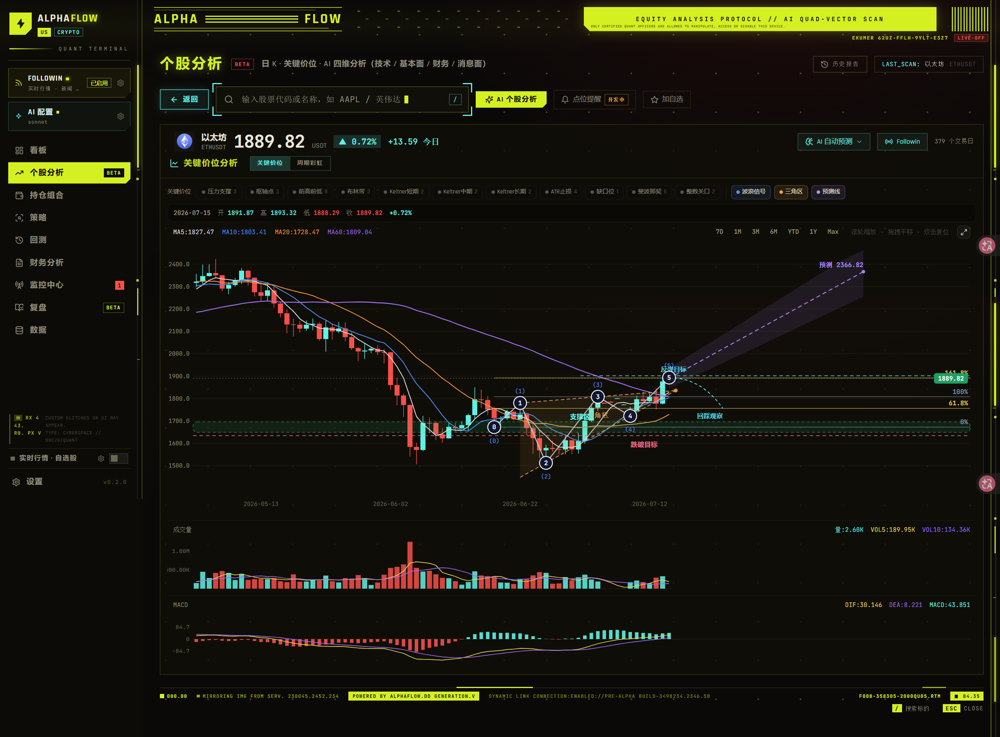

# 项目截图

### 看板 Dashboard

### 周期彩虹 Cycle Wave(BTC/ETH)

全量历史周期着色 + 牛熊/减半标注 + 抄底/卖出价位带:

### 策略 Screener

### 回测 Backtest

### 监控中心 Monitor

### 财务分析

### 财务分析报告

### 个股分析

### 个股分析报告

### 复盘

### 飞书推送-自动复盘

### 飞书推送-个股监控

